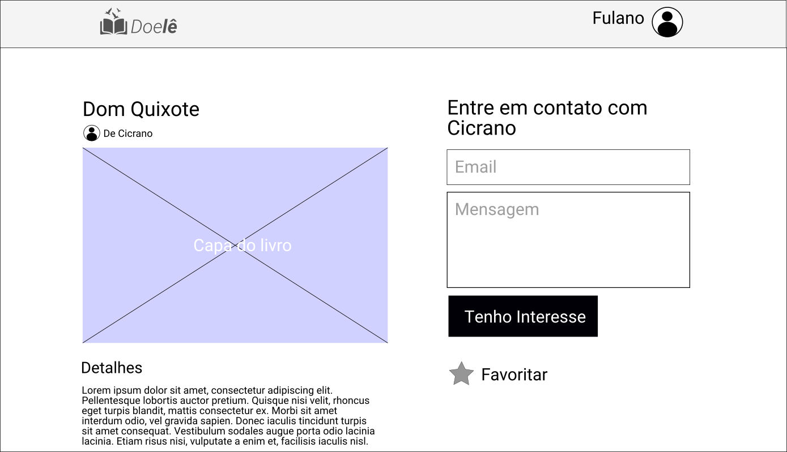

# Especificação de Caso de Uso do Projeto Doelê

# CDU05: **Solicitar Livro**  

## 1. Resumo

O usuário logado busca por um livro e confirma seu interesse em receber a doação.

## 2. Atores

* Donatário;
* Doador;

## 3. Precondições

###  3.1 Estar logado  

O usuário deve estar logado no sistema.

###  3.2 Ter feito cadastro de livros

O usuário deve ter feito cadastro de livros no sistema.

###  3.3 Ter feito doações

O usuário já precisa ter realizado doações de livros.

## 4. Pós-condições
### 4.1 A solicitação será notificada ao doador

A solicitação será notificada ao doador para que este juntamente ao donatário decidam a melhor forma de realizar esta doação.

## 5. Pontos de Extensão

Não identificados.

## 6. Fluxos de Evento

### 6.1 Fluxo Básico

1. o donatário insere o email, uma mensagem para o doador e seleciona a opção "Tenho Interesse";
1. o sistema mostra uma mensagem de confirmação com os dados do livro;
1. o ator seleciona **SIM**;
1. o sistema envia uma notificação ao doador;
1. o CDU é finalizado e é exibida a tela principal.

### (2A) 6.2 Há outros interessados no livro;

1. o sistema informa que outras pessoas demonstraram interesse e pergunta se o donatário tem interesse;
1. o ator informa que **SIM**;
1. o sistema volta ao passo 4 do fluxo principal.

### (2B) 6.3 Há outros interessados no livro;

1. o sistema informa que outras pessoas demonstraram interesse e pergunta se o donatário tem interesse;
1. o ator informa que **NÃO**;
1. o sistema volta ao passo 5 do fluxo principal.

## 7. Protótipos de Interface do Caso de Uso

## 8. Diagrama de Atividades do Caso de Uso

## 9. Diagrama de Projeto do Caso de Uso

O diagrama ainda não foi feito.

## 10. Diagrama de Sequência do Caso de Uso

