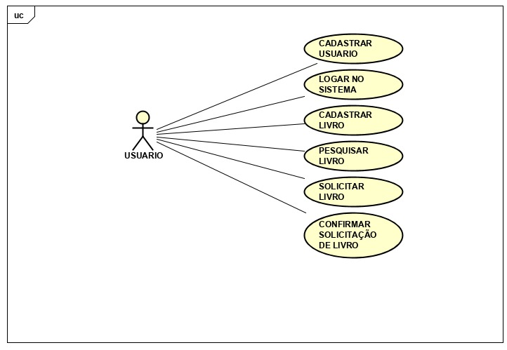

# Documento de visão
# www-doele
## 1. Introdução
### 1.1 Resumo

    Texto resumindo o documento.

### 1.2 Escopo

**Faz Parte do Escopo**

1. O sistema permitirá que os usuários se cadastrem.
1. O sistema irá diferenciar usuários comuns(pessoas físicas) de usuários institucionais(ONG's, por exemplo)
1. O sistema permitirá que usuários instituicionais criem campanhas de arrecadação e doação de livros.
1. O sistema permitirá que os usuários vejam os livros anunciados.
1. O sistema permitirá que os usuários pesquisem livros por título e/ou autor.
1. O sistema permitirá que usuários comuns anunciem livros.
1. O sistema permitirá que os usuários demonstrem interesse em doar para uma campanha de arrecadação instituicional.
1. O sistema permitirá que os usuários demonstrem interesse em receber a doação de um livro.
1. O sistema notificará o usuário doador quando um livro anunciado receber uma demonstração de interesse.
1. O sistema permitirá que os usuários envolvidos em uma doação (doador e donatário)confirmem a conclusão da transação(doação).
1. O sistema permitirá que os usuários façam avaliações de transações concluídas com sucesso.
1. O sistema permitirá que os usuários façam avaliações de livros.

**Não Faz Parte do Escopo**
    
1. O sistema não terá chat para interação entre doador e donatário. 
1. O sistema não será responsável pela entrega dos livros.
1. O sistema não será responsável pela avaliação do estado físico do livro.

## 2. Requisitos

### 2.1 Requisitos Funcionais

| Cod. | Nome | Descrição | Categoria |
| -------- | -------- | -------- | -------- |
| F01 | Registro no sistema | O usuário fará login no sistema para ter acesso ao material disponível no site. |	Evidente|
| F02 | Cadastro de livros | O usuário ao fazer login no sistema poderá cadastrar livros para doação. | Evidente|
| F03 | Busca de livros | O usuário que acessar o sistema poderá buscar pelos livros anunciados. | Evidente|
| F04 | Solicitação de livros| O usuário logado no sistema poderá demonstrar interesse em um livro anunciado. | Evidente|

### 2.2 Requisitos não funcionais

| Cod. | Nome | Descrição | Categoria |
| -------- | -------- | -------- | -------- |
| NF01 | Aplicação Web | A aplicação deverá ser inicialmente em um sistema Web. | Obrigatório|
| NF02 | Play Framework | A aplicação deverá ser inicialmente desenvolvida utilizando o play framework. | Obrigatório|

### 2.3 Tabela de Referência - Requisitos

| | NF01 | NF02 | NF03 |
| -------- | -------- | -------- | -------- |
| F01 | X | X |	|
| F02 |  | | X |

### 2.4 Diagrama Geral de Casos de Uso

### 2.5. Casos de Uso

| Cod. | Caso de Uso | Descrição | Classificação |
| -------- | -------- | -------- | -------- |
| UC01 | Cadastrar Usuário | O usuário preenche os dados solicitados no formulário de registro e recebe uma confirmação do cadastro | Primário |
| UC02 | Logar Usuário | O usuário preenche o formulário de login com o email e a senha e é autenticado no sistema | Secundário |
| UC03 | Cadastrar Livro | O usuário logado preenche os dados do livro no formulário de cadastro e recebe a confirmação de que o livro foi cadastrado com sucesso no sistema | Primário |
| UC04 | Buscar Livro | O usuário digita o nome de um livro no campo de busca | Primário |
| UC05 | Solicitar Livro | O usuário logado busca por um livro e confirma seu interesse em receber a doação | Primário |
| UC06 | Confirmar Solicitação de Livro | O usuário doador recebe uma notificação informando que um usuário demonstrou interesse em seu livro anunciado | Primário |

### 2.6. Tabela de Referência - Casos de uso & Requisitos

| | NF01 | NF02 | NF03 | F01 | F02 | F03 |
| -------- | -------- | -------- | -------- | -------- | -------- | -------- |
| UC01 | X | X | | | X | X |

### 2.7. Atores

| Ator | Descrição |
| -------- | -------- |
| | |  

## 3. Clientes

    Texto explicando quem é o cliente
